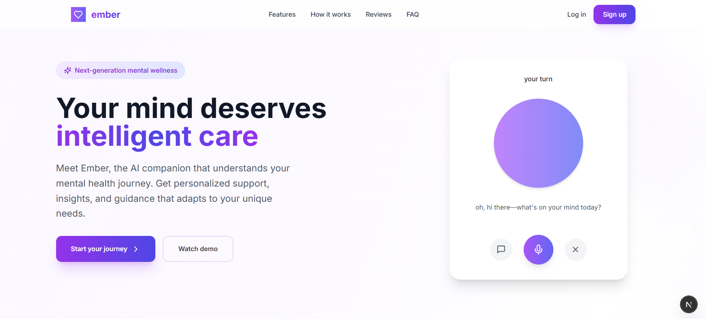
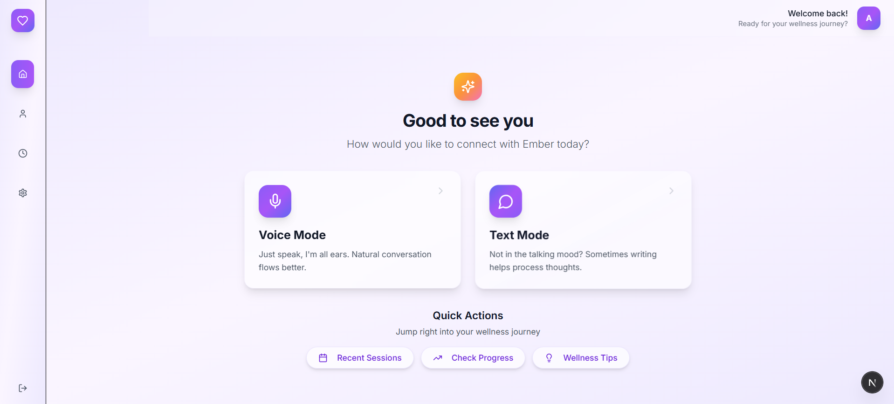
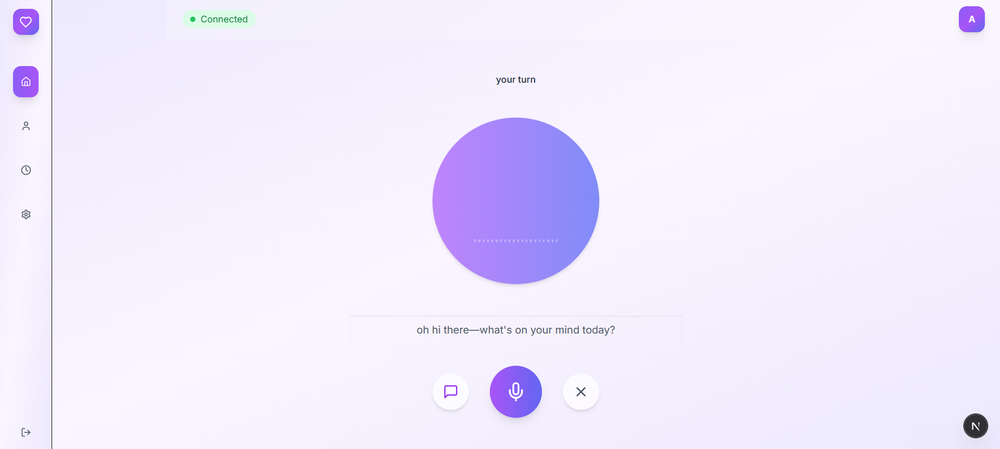
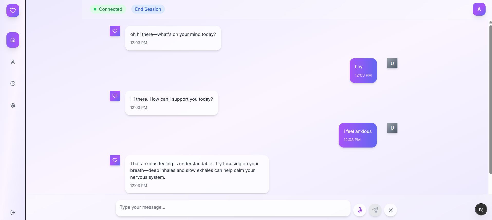
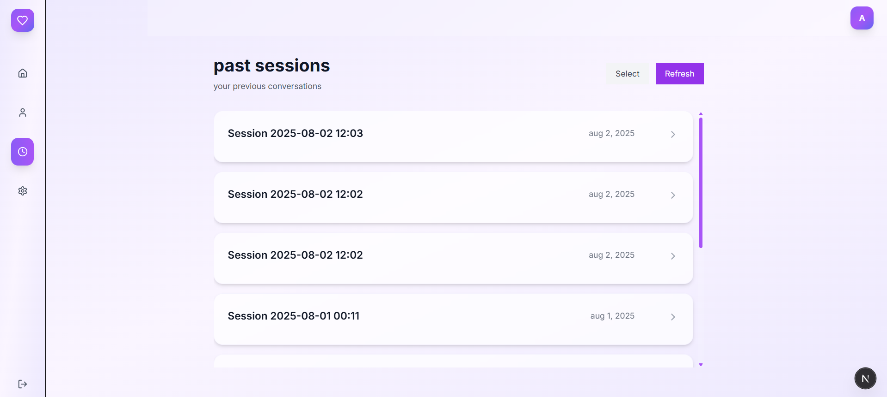
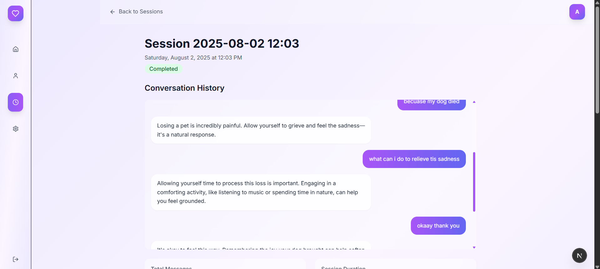
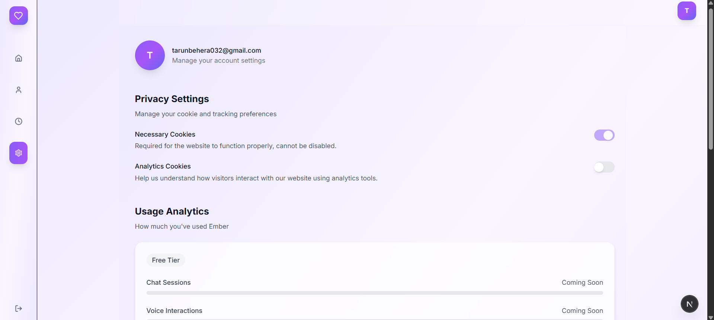

# 🔥 Ember - Your Personal Mental Health AI Companion

Ember is a voice-enabled mental health companion designed to provide supportive conversations and therapeutic guidance through artificial intelligence. Built with modern web technologies, Ember offers both voice and text-based interactions to help users process their thoughts, emotions, and daily challenges in a safe, private environment.

## ✨ What is Ember?

Ember serves as your personal mental health companion, available 24/7 to listen, understand, and provide thoughtful responses to your concerns. Whether you're dealing with stress, anxiety, relationship issues, or simply need someone to talk to, Ember creates a judgment-free space where you can express yourself freely.

The system combines advanced speech recognition, natural language processing, and voice synthesis to create conversations that feel natural and supportive. Every interaction is designed to help you gain insights into your thoughts and feelings while providing practical coping strategies and emotional support.

## 🌟 Key Features

### 🎙️ Voice & Text Conversations
Ember supports both voice and text-based interactions, giving you the flexibility to communicate in whatever way feels most comfortable. Speak naturally and receive spoken responses back, or type your thoughts when privacy is needed.

### 🧠 Intelligent Response System  
Powered by Google's Gemini AI, Ember understands context, remembers your conversation flow, and provides responses tailored to your specific situation. The AI is trained to respond with empathy, understanding, and practical guidance.

### 📊 Session Management & History
Every conversation with Ember is organized into sessions that you can revisit anytime. Track your emotional journey, review past insights, and see how your thoughts and feelings evolve over time.

### 📝 Automatic Session Summaries
After each conversation, Ember automatically generates comprehensive summaries highlighting key discussion points, emotional patterns, and practical takeaways. These summaries help you reflect on your progress and identify recurring themes.

### 👤 Personalized Experience
Create your profile to customize how Ember responds to you. Set preferences for conversation style, response length, and communication tone to make every interaction feel personal and relevant.

### 🔒 Privacy & Security
Your conversations are private and secure. Built with Supabase authentication and proper data protection, ensuring your personal thoughts and feelings remain confidential.

## 🛠️ How It Works

### Voice Processing with Whisper
When you speak to Ember, your voice is processed using OpenAI's Whisper model, which accurately transcribes your speech into text. This industry-leading speech recognition ensures Ember understands you clearly, even with background noise or different accents.

### Natural Language Understanding with Gemini
Your messages are processed by Google's Gemini AI model, which analyzes the context, emotional tone, and content of your communication. Gemini provides thoughtful, empathetic responses that feel genuinely helpful and understanding.

### Voice Synthesis with ElevenLabs
Ember's responses are converted back to natural-sounding speech using ElevenLabs' advanced voice synthesis technology. This creates a more personal, human-like conversation experience.

### Real-time Backend with FastAPI
The entire system runs on a high-performance FastAPI backend that handles voice processing, AI communications, and data management in real-time. This ensures smooth, responsive conversations without delays.

### Secure Data Storage with Supabase
All your conversations, session data, and personal preferences are securely stored using Supabase, a modern database platform that ensures your data is protected and always available when you need it.

### Conversation Analytics & Insights
Beyond just storing conversations, Ember analyzes patterns in your discussions to generate meaningful insights about your emotional well-being, helping you understand your mental health journey better.

## 📱 Screenshots

### Landing Page


### Dashboard Overview

*Main dashboard showing session history and quick actions*

### Voice Interface  

*Real-time voice conversation with Ember*

### Text Inferface

*Text-based conversation with Ember*

### Session History

*Track all your conversations and emotional journey*

### Inside the Session

*See your conversation with Ember and also get a summary of your chat*

### Settings

*Manage all your settings *


## 🚀 Getting Started

### Prerequisites
- Node.js (v18 or higher)
- Python (v3.8 or higher)
- Supabase account
- API keys for Gemini, Whisper, and ElevenLabs

### Frontend Setup
```bash
# Install dependencies
npm install

# Start the development server
npm run dev
```

### Backend Setup
```bash
# Navigate to backend directory
cd backend

# Install Python dependencies
pip install -r requirements.txt

# Copy environment variables
cp .env.example .env

# Add your API keys to .env file
# Start the backend server
python app.py
```

### Environment Configuration
Create a `.env` file with your API credentials:
- Supabase URL and keys for authentication and data storage
- Google Gemini API key for AI responses
- OpenAI API key for Whisper speech recognition
- ElevenLabs API key for voice synthesis

## 💡 Why Ember?

Mental health support should be accessible, private, and available whenever you need it. Ember bridges the gap between traditional therapy and daily emotional support by providing:

- **Immediate availability** - No appointments needed, available 24/7
- **Judgment-free environment** - Express yourself without fear of judgment
- **Consistent support** - Reliable emotional guidance whenever you need it
- **Privacy protection** - Your conversations remain completely confidential
- **Progress tracking** - See your emotional growth over time
- **Personalized experience** - Tailored responses that understand your unique situation

## 🔧 Technology Stack

**Frontend:** Next.js, TypeScript, Tailwind CSS, React
**Backend:** FastAPI, Python
**Database:** Supabase (PostgreSQL)
**AI & ML:** Google Gemini API, OpenAI Whisper, ElevenLabs Voice AI
**Authentication:** Supabase Auth with JWT tokens
**Deployment:** Vercel (Frontend), Cloud hosting (Backend)

## 📄 License

This project is licensed under the MIT License - see the LICENSE file for details.

## 🤝 Contributing

We welcome contributions! Please feel free to submit issues, feature requests, or pull requests to help make Ember even better.

## ⚠️ Current Limitations & Areas for Improvement

**Please note that Ember is currently in active development and has several known limitations that need to be addressed:**

### 🔴 Critical Issues
- **Session Isolation**: Currently, all users can see all sessions regardless of who created them. User-specific session filtering needs to be implemented to ensure privacy and data isolation.
- **Authentication Flow**: Some authentication edge cases need proper handling and error management.

### 🟡 Features Under Development
- **Enhanced User Profiles**: More detailed customization options for AI response styles
- **Advanced Analytics**: Better insights and emotional pattern tracking
- **Mobile Responsiveness**: Optimizing the interface for mobile devices
- **Performance Optimization**: Improving response times and overall system efficiency
- **Error Handling**: More robust error handling throughout the application
- **Data Validation**: Stronger input validation and sanitization
- **Session Management**: Better session lifecycle management and cleanup

### 🟢 Future Enhancements
- **Multi-language Support**: Support for conversations in different languages
- **Export Features**: Ability to export session summaries and insights
- **Integration Options**: Calendar integration for session reminders
- **Advanced AI Models**: Integration with newer AI models for better responses

**We're actively working on these improvements and welcome contributions from the community to help make Ember better and more secure for everyone.**

---

*Ember is designed to supplement, not replace, professional mental health care. If you're experiencing severe mental health issues, please consult with a licensed mental health professional.*